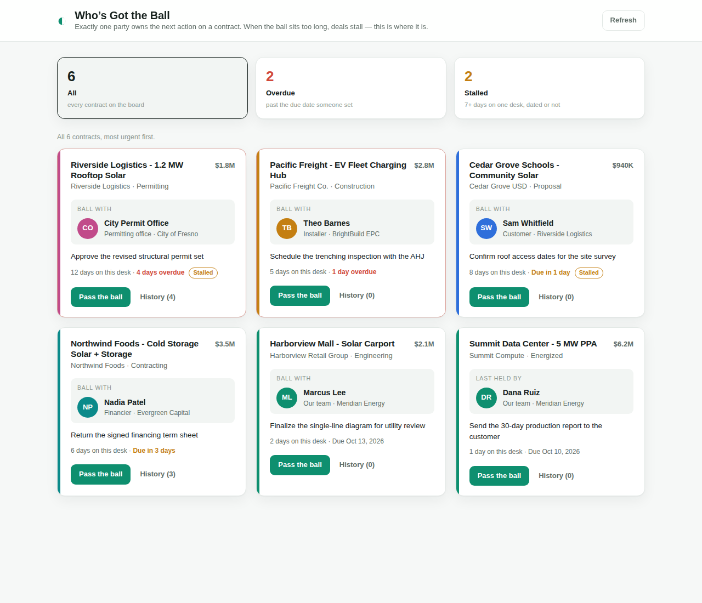

# Who's Got the Ball (Nuxt)

**Live:** https://whos-got-the-ball-nuxt.onrender.com

A Nuxt 3 + Vue + TypeScript port of
[whos-got-the-ball](https://github.com/seanhelvey/whos-got-the-ball), which is
Flask, Strawberry GraphQL and React. It is a true port. The GraphQL schema, the
three tables, the seed data and the screens are the same, and nothing behaves
differently.

The app tracks who owns the next action on a clean energy contract. Work moves
between your own team, the customer, the utility, the installer, the financier
and the permitting office. Whoever holds the ball owes the next step, and when it
sits too long the deal stalls.



*The original React app. The Vue port renders the same board.*

## Run it

Needs Node 22.13 or newer, for the built in `node:sqlite`.

```bash
npm install
npm run dev        # http://localhost:3000
```

The UI, the API and the GraphiQL explorer share one port. GraphQL lives at
`/graphql`, the same path as the original. The SQLite file is created and seeded
on first boot at `.data/ball.db`. Delete it to reset to the sample data. Set
`DATABASE_PATH` to put it somewhere else.

## Test it

```bash
npm test           # Vitest, a port of the original test_api.py
npm run typecheck
```

The tests build the API against a throwaway database and read top to bottom as a
tour of every query and both mutations.

## Review it

Pull requests are reviewed by Claude, locally, so no Claude token is stored on
GitHub. In Claude Code, run:

```
/code-review 12 --comment
```

That reviews PR 12 and posts the findings on it. `/code-review` is built into
Claude Code, so there are no skill files here. The repo supplies only the rules,
in [CLAUDE.md](CLAUDE.md): review changed code only, no broad refactors, findings
ranked most severe first, and any drift from the original counts as a bug.

[.github/workflows/review.yml](.github/workflows/review.yml) does the same review
in GitHub Actions. It is manual only for now. To run it on every pull request,
add a `CLAUDE_CODE_OAUTH_TOKEN` secret and switch its trigger to `pull_request`.

`package-lock.json` is marked generated in `.gitattributes`, so it shows as one
line in diffs and reviews read only real code.

## Deploy it

`render.yaml` is a Render Blueprint for one Node web service. In Render, choose
New, then Blueprint, and point it at this repo. It builds with `npm run build`
and starts `node .output/server/index.mjs`. The database sits on the instance's
ephemeral disk, so each deploy boots onto a freshly seeded board, as the
original's container did.

## What each piece is

```
server/lib/models.ts   constants, row types, and the overdue / stalled / done rules (models.py)
server/lib/db.ts       SQLite tables, queries, passBall and updateStatus (models.py + schema.py)
server/lib/seed.ts     the same fictional seed data (seed.py)
server/lib/schema.ts   the GraphQL SDL and resolvers on graphql-yoga (schema.py)
server/routes/graphql.ts  mounts the API at /graphql (app.py)
server/plugins/db.ts   creates and seeds the database on boot (app.py)
tests/api.test.ts      the API tour (test_api.py)
render.yaml            Render Blueprint (Dockerfile)

pages/index.vue        the board, filter state, pass the ball flow (App.tsx)
components/            BoardFilter, ContractCard, PassBallModal, HandoffTimeline,
                       KindBadge and StakeholderAvatar (components/*.tsx)
lib/                   types.ts, api.ts and format.ts, carried over unchanged
assets/styles.css      the original stylesheet, one selector renamed
```

## What changed from the original, and why

The contract is identical. Running both apps side by side, the full board query
returns the same JSON and introspection returns the same schema, type names
`ContractType`, `StakeholderType` and `HandoffType` included. What differs is
underneath.

| Original | Port | Why |
| --- | --- | --- |
| Strawberry types from Python hints | SDL string plus resolvers on graphql-yoga | Yoga is the common Node server and the SDL is copied verbatim from what Strawberry printed |
| SQLAlchemy models | Plain SQL on `node:sqlite` | No ORM needed for three tables, and no native module to compile on Render |
| Flask plus gunicorn in Docker | Nitro, the server inside Nuxt | One process serves pages and API, as before |
| `DATABASE_URL`, Postgres optional | `DATABASE_PATH`, SQLite only | The brief was SQLite. The Postgres path was never exercised in the original |
| Timestamps with microseconds | Timestamps with milliseconds, padded | JavaScript dates stop at milliseconds |

On the front end, `types.ts`, `api.ts` and `format.ts` are copied across with
only comments touched, and the stylesheet changes one selector, `#root` to
`#__nuxt`. The single copy change is the error banner's hint, which now says
`npm run dev` instead of `python app.py`, since there is no Python here.

Kept on purpose, quirks included: resolvers still build the whole object graph,
so the N+1 queries the original's README calls out are still here. Statuses and
kinds are still plain strings. There is still no authentication, and GraphiQL is
still public.

## React vs Vue, side by side

The same screens, so the differences are all in how the components say it.

| Concern | React original | Vue port |
| --- | --- | --- |
| Local state | `useState`, set through a setter | `ref`, assigned directly with `.value` in script and bare in the template |
| Derived values | `useMemo` with a dependency array | `computed`, which tracks its own dependencies |
| Loading on mount | `useEffect(() => load(), [])` | `onMounted(load)` |
| Listeners with cleanup | returned from `useEffect` | paired `onMounted` and `onUnmounted` |
| Conditionals and lists | `&&`, ternaries and `.map()` in JSX | `v-if`, `v-else` and `v-for` in the template |
| Child to parent | callback props (`onPassBall`, `onClose`) | emits (`@pass-ball`, `@close`) |
| Two way binding | `value` plus `onChange` on every field | `v-model`, and `defineModel` for the filter tiles |
| Async callback the child awaits | `onSubmit` prop returning a promise | still a function prop, `submit`, because an emit cannot hand back a promise |
| Refs to DOM nodes | `useRef` | a template `ref` with the same name as a `ref()` |
| Sharing a constant from a component file | a named export next to the component | a second, plain `<script>` block, since `<script setup>` cannot export |
| Styling | one global stylesheet | the same stylesheet, loaded through `css` in `nuxt.config.ts` |

Two things look the same but work differently. React rerenders the whole
component and diffs the output, so `byAttention` and the tile counts rerun on
every render unless memoized. Vue tracks which refs each `computed` read and only
recomputes when one changes, so there is no dependency array to get wrong.

And the board is fetched in the browser after mount, exactly as before, rather
than during server rendering. Nuxt could render it on the server, but the due
and "days ago" labels are worked out against the viewer's clock, and a server
in another timezone would print a different day than the browser then hydrates.
